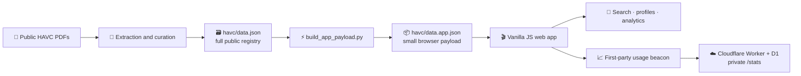

# 🎬 Sredstva

> **Croatian audiovisual public funding, made searchable, inspectable, and traceable.**

**Sredstva** is an open public-data explorer for funding decisions published by the Croatian Audiovisual Centre (HAVC). It turns a long, scattered archive of source PDFs into a bilingual registry that people can actually investigate: search a project, compare years, follow a recipient, inspect an amount, and open the document it came from.

🌐 **Live app:** [havc.matijar.info](https://havc.matijar.info)<br>
🗃️ **Full public registry:** [`havc/data.json`](https://havc.matijar.info/havc/data.json)<br>
📄 **Primary source:** [HAVC public calls](https://havc.hr/o-nama/javni-pozivi)

<br />

## Why this exists

HAVC publishes public funding decisions, but mostly as PDFs distributed across an old website. That makes the information technically public yet practically difficult to use: it cannot be searched across years, filtered consistently, aggregated safely, or followed from one funding round to the next.

Sredstva is a practical answer to that gap. It is an independent, non-commercial tool for filmmakers, producers, researchers, journalists, and anyone who wants to inspect how Croatian audiovisual public funding is allocated.

The project does not replace the original documents. It makes them usable—and keeps every important number connected to its source.

## ✨ What you can do

- 🔎 Search and filter funding decisions by year, programme, category, round, recipient, creator, and project.
- 🧭 Open project profiles with people, funding history, linked decisions, source PDFs, and jury narratives where available.
- 📊 Explore an interactive analytics studio for time series, award-size distribution, programme mix, recipient concentration, and project lifecycles.
- 🔗 Create shareable links to a filtered view or a project.
- 🌐 Switch between Croatian and English.
- 🌓 Use light, dark, or system theme.
- ♿ Navigate with a keyboard and inspect chart data through exact, accessible tables.

## 📌 Current registry snapshot

The checked-in registry currently contains:

| Coverage | Current checkout |
| --- | ---: |
| Source documents | 1,017 |
| Funding rows | 9,543 |
| Verified awarded rows | 9,542 |
| Year range | 2008–2026 |
| Full source-of-truth dataset | 18 MiB |

These are a snapshot of the repository’s current data, not a claim that the archive is complete or permanently final. The app calculates its visible figures from the loaded dataset, so its live totals follow the deployed data.

## 🧠 How it works



### Data, not magic

The pipeline combines deterministic extraction and curation work:

1. Public HAVC source documents are parsed into structured records.
2. Suspect rows, amount formats, duplicated material, people fields, and recurring project identities are reviewed in explicit passes.
3. Every results row receives an explicit funding status. Dashboard totals use verified awards only.
4. The full registry remains published as `data.json`; the browser boots from the smaller `data.app.json` projection.
5. Audit and sanity-check artifacts remain in the repository so the work can be examined, challenged, and improved.

This is public-data interpretation, not an official HAVC service. For high-stakes use, always inspect the linked source PDF and treat the dataset, its source coverage, and its documented limitations as part of the result.

## 🧱 Technology

Sredstva is deliberately simple on the client:

- **Vanilla HTML, CSS, and JavaScript** — no framework, no bundler, no client dependency install.
- **Cloudflare Workers** — first-party event intake and protected owner statistics.
- **Cloudflare D1 + Durable Objects** — aggregate usage storage and scheduled archival.
- **Python** — dataset curation, validation, and creation of the slim browser payload.
- **Node test runner + Python `pytest`** — browser, analytics, Worker, and data-pipeline checks.

The visual system is intentionally closer to a public ledger than a SaaS dashboard: warm paper, dark ink, exact values, visible provenance, and a single restrained red accent for consequential states.

## 🗂️ Repository map

```text
.
├── index.html                 # App shell
├── main.js                    # Registry UI, i18n, filters, profiles, data adapter
├── analytics-core.js          # Reusable analytics calculations
├── analytics-studio.js        # Interactive analytical views
├── usage.js                   # Privacy-conscious first-party usage collector
├── style.css                  # Full application styling
├── content/                   # Bilingual About and Process content
├── havc/
│   ├── data.json              # Full curated registry — public source of truth
│   ├── data.app.json          # Slim payload fetched by the app
│   ├── clean_data.py          # Curation and validation workflow
│   ├── build_app_payload.py   # Full-registry → browser-payload projection
│   ├── *audit*.json           # Review decisions and audit receipts
│   └── 10_sanity_check_official.json
│                              # Cross-check against published HAVC totals
├── worker/                    # Cloudflare Worker, D1 aggregation, /stats renderer
├── test/                      # Node and browser smoke tests
├── tests/                     # Python curation-pipeline tests
└── wrangler.jsonc             # Cloudflare deployment configuration
```

## 🚀 Run locally

The public application is static. From the repository root:

```powershell
python -m http.server 8080
```

Then open [http://localhost:8080](http://localhost:8080).

The Worker-backed usage endpoint and private `/stats` surface are not needed to browse the registry locally.

## ✅ Verify changes

Run the checks appropriate to the area you changed:

```powershell
# JavaScript unit and Worker tests
npm test

# Data-curation tests
python -m pytest -q

# Browser smoke test for the registry and analytics studio
npm run test:browser

# Browser smoke test for the private statistics renderer
npm run test:stats-browser
```

The browser smoke scripts are Windows-oriented and expect Google Chrome at its standard installation path. They start their own local server and write verification screenshots outside this repository.

## 🔄 Working with the dataset

`havc/data.json` is the canonical public registry. The app normally loads the much smaller `havc/data.app.json` boot payload, which is a field-limited projection of that canonical file.

After a deliberate data change, rebuild the browser payload:

```powershell
python havc/build_app_payload.py
```

The projection script includes equivalence assertions for document count, row count, and awarded-amount sum. The broader `clean_data.py` workflow can also rebuild it when run with its write mode; review that script and its audit outputs before changing curated data.

## 🔐 Usage measurement and privacy

Sredstva has a small first-party usage system so the maintainer can understand which features work and how the registry performs. It is intentionally constrained:

- 🍪 No analytics cookies or persistent visitor ID.
- 🧠 One random identifier exists only in the memory of the open browser tab.
- 🚫 No IP addresses, full user agents, search text, or filter values are stored.
- 📉 Stored data is aggregate feature and performance information such as app readiness, filter type, opened source PDFs, and Web Vitals.
- 🔒 The `/stats` dashboard is protected behind Cloudflare Access.

See [`extension-privacy/index.html`](extension-privacy/index.html) for the full bilingual privacy policy, including the separate HAVC Companion browser extension.

## 🤝 Contributing

Contributions are welcome—especially improvements to source coverage, extraction reliability, data validation, accessibility, translations, and documentation.

Please keep the project’s core rule intact: **a convenient interface must never sever the connection between a claim and its source.** Small, focused pull requests with a clear explanation and relevant tests are easiest to review.

## ⚖️ Independence and provenance

Sredstva is an independent project and is **not affiliated with or endorsed by HAVC**. HAVC remains the publisher of the original public documents; this repository contains an independently structured, curated representation of them.

If an official open, structured, continuously maintained HAVC dataset replaces this work one day, that is a success for the underlying goal.

---

Built in Zagreb by [Matija Radeljak](https://github.com/matijarma) · **make public records usable** ✦
